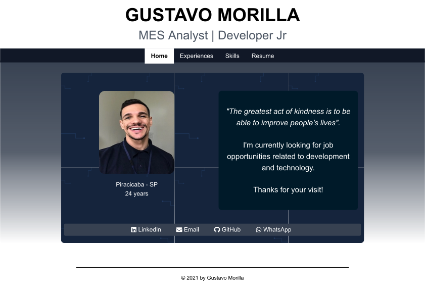

##### My Profile

<h1 align="center">
    
</h1>

## 🧪 Tecnologia

Esse projeto foi desenvolvido com:

- [NextJS](https://nextjs.org/)
- [Tailwind CSS](https://tailwindcss.com/)

## 💻 Projeto

Perfil onde apresento diversas informações sobre a minha experiência profissional, minhas habilidades e disponibilizo meu curriculo para leitura e download.
Desenvolvido com o intuito de explorar NextJS e alguns conceitos de responsividade.

Acesse: www.morilla.com.br

## 🔖 Layout

Você pode visualizar o layout do projeto através do link abaixo:

- [Layout Web](https://www.figma.com/file/jrN9Vdmtmq6egJPtuqnLut/Profile?node-id=0%3A1)

Lembrando que você precisa ter uma conta no [Figma](http://figma.com/).
